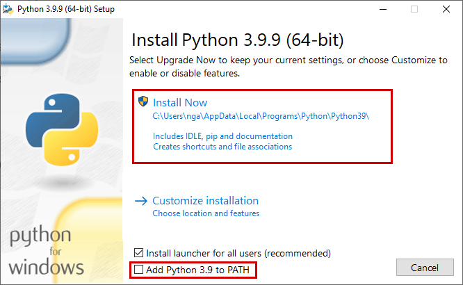
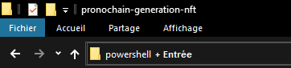

# Génération NFT

La génération NFT consiste à créer une solution permettant de récupérer les différentes parties d'un visage d'une personne réelle, styliser ces parties, les stocker dans la blockchain IPFS et par la suite en assembler plusieurs pour réaliser une carte NFT avec des niveaux de raretés différents. Cette fonctionnalité est accessible via une API.

- [Getting Started](#getting-started)<br>
  **1** . [Installation de Python 3.9](#first)<br>
  **2** . [Création de l'environnement de développement virtuel](#second)<br>
  **2BIS**. [Version de python déjà présente](#secondbis)<br>
  **3** . [Activation de l'environnement de développement virtuel](#third)<br>
  **4** . [Installation des packages](#fourth)<br>
  **5** . [Initialisation des variables d'environnements](#fifth)<br>
  **6** . [Installation et démarrage du conteneur docker](#sixth)<br>
  **7** . [Commencer à développer](#seventh)<br>
- [Explication docker](#explication-docker)
    - [Docker-compose - Contenu](#contenu)
    - [Dockerfile - Build](#build)
    - [Docker-compose - Up](#up)
- [Warnings](#warnings)
- [Documentations](#documentations)

<br>

# Getting Started

Pour pouvoir commencer à développer dans les meilleures conditions, plusieurs installations sont nécessaires. Cette documentation est réalisée pour **Windows** uniquement. En ce qui concerne **Linux**, il vous faudra suivre des tutoriels en ligne pour l'installation de Python et pour connaître le chemin du langage (**étape 1, 2 et 2BIS**). Le reste des étapes seront identiques.

## <a id="first"></a>**1**. **Installation** de [**Python 3.9**](https://www.python.org/ftp/python/3.9.9/python-3.9.9-amd64.exe)



Par défaut, python va s'installer sur **AppData/Local/Programs/Python39**. Pour y accéder **Win + R** puis saisissez %appdata%. L'explorer de fichiers va s'ouvrir dans **AppData/Roaming**. Il vous suffira d'aller dans le parent puis remonter le chemin.<br>

**Ce chemin sera utile si vous avez déjà une autre version de python installée sur votre ordinateur.**
Si vous avez déjà une version de Python installé autre que la 3.9 : **3.7, 3.8** ... Il y a plusieurs solutions :
- **Désinstaller les autres versions** et garder uniquement la 3.9 (conseillé).
- **Suivre** l'étape **2BIS**.

Pour information, Python 3.10 est disponible depuis la fin d'année 2021, cependant beaucoup de packages ne sont pas encore compatibles et aucun changement n'est réellement impactant sur notre solution.<br><br>

## <a id="second"></a>**2**. **Création** de l'**environnement de développement virtuel**

Dans les dernières versions de Python, l'environnement virtuel **venv** est installé nativement. Rendez-vous dans le dossier de la solution et ouvrez un terminal powershell.



Commande pour créer l'environnement (**lire phrase en dessous avant**):

    python -m venv pronochain
**Si vous avez déjà une version de python, rendez-vous étape 2BIS**.


L'environnement de développement  virtuel va vous permettre d'installer tous ce qui concerne la solution dans un dossier du projet, ce qui évitera d'installer les différents packages en global sur votre ordinateur et de contrôler de A à Z ce que l'application utilise.<br><br>

## <a id="secondbis"></a>**2BIS**. **Version** de python déjà **présente**

Dans la même console, rentrez la commande :

    python -V

Si la version qui apparaît est **python 3.9.x** alors vous pouvez reprendre l'étape 3, sinon **copier** le chemin de la version Python 3.9. Personnellement, le chemin est **C:\Users\nga\AppData\Local\Programs\Python\Python39**.

Puis exécutez la commande suivant pour créer l'environnement de développement virtuel avec la version de python choisie.

    COLLER/LE/CHEMIN/ICI -m venv pronochain

<br>

## <a id="third"></a>**3**. **Activation** de l'**environnement de développement virtuel**

Pour pouvoir utiliser l'environnement virtuel, il faut l'**activer**. **IL FAUT TOUJOURS ACTIVER** l'environnement avant de commencer à développer pour éviter d'installer les packages sur votre ordinateur au lieu de les installer dans le dossier.<br><br>
Dans la console, tapez :

    pronochain/Scripts/activate

Vous verrez normalement le nom de votre environnement virtuel en vert devant le chemin dans la console. Sur **Visual Studio Code**, si vous ouvrez le dossier entier dans le logiciel, vous pouvez afficher un terminal et choisir la version powershell. Il vous sera plus facile d'activer l'environnement pendant que vous développez.

Pour désactiver l'environnement, il vous suffira de faire :

    deactivate

Enfin, pour supprimer l'environnement, car une manipulation a été mal faite, fermer **toutes les consoles** ou **Visual Studio Code** et supprimer simplement le dossier *pronochain*. <br><br>

## <a id="fourth"></a>**4**. **Installation** des **packages**

Pour installer tous les packages nécessaires pour faire fonctionner la solution, il vous suffit de taper ces commandes à la suite :

    python -m pip install -r requirements.txt
    python -m pip install -r requirements-dev.txt

Le fichier **requirements.txt** est l'équivalent du fichier package.json. Il comporte la liste de tous les packages.<br><br>
Lorsque vous souhaitez ajouter un nouveau package, il faudra **IMPÉRATIVEMENT** ajouter **python -m** devant **pip install** puis d'ajouter le nom du package dans **requirements.txt**. Une documentation a été faite uniquement à ce sujet.<br><br>

## <a id="fifth"></a>**5**. **Initialisation** des **variables d'environnements**

Notre application aura besoin de plusieurs variables d'environnements en guise de **configuration**. Par exemple, la connexion à la base de données. Une documentation sera créée pour connaître toutes les variables d'environnements à modifier. **Un fichier** est important pour cette partie :
- **.env.example** : contient les variables sans leur vraie valeur avec leur patterns

Le fait qu'il n'y ait pas de valeur est plutôt logique. Nous n'allons pas mettre dans le **répertoire GIT** les clés secrètes.
La première manipulation est de copier-coller le fichier et de le renommer en **supprimant le '.example'**.
Une fois copié, passez à l'étape suivante. **Cependant, il vous faudra modifier les variables d'environnements par la suite grâce à la documentation**.<br><br>

## <a id="sixth"></a>**6**. **Installation et démarrage** du **conteneur docker**

Toujours dans la même console, à la racine du projet.
Un conteneur docker a été configuré pour vous faciliter le développement, mais aussi le déploiement. Une fois le conteneur docker lancé en mode développement, vous pourrez démarrer l'API ou accéder au service externe de la documentation. L'**API** sera joignable via [**http://localhost:8000**](http://localhost:8000) et le **swagger** via [**http://localhost:8000/docs**](http://localhost:8000/docs).

Pour créer et démarrer le conteneur au premier lancement :

    docker-compose pull && docker-compose -f docker-compose.yml -f docker-compose.dev.yml up --build -d

Pour simplement démarrer le docker après le premier lancement :

    docker-compose up -d

**Pour information, un autre docker-compose existe pour la version de production qui lance automatiquement l'API et qui n'a pas les packages de développement ni la documentation.**

Par la suite, pour démarrer l'API en développement, il suffira d'exécuter cette commande sur votre terminal VSCode (par exemple) :

    docker exec -it pronochain_fastapi python app/launch.py -d

Le fichier **launch.py** va démarrer l'API en version développement avec cette commande :

  uvicorn app.generation_nft_api.main:app --host 0.0.0.0 --debug --reload

- **--host** : rends accessible l'application depuis l'IP du serveur ou depuis votre local.
- **--debug** : nom assez explicite pour comprendre
- **--reload** : si vous modifiez le code dans l'API, celle-ci redémarrera automatiquement. **Attention, si une erreur 500 (erreur serveur) est détectée, il faudra redémarrer l'API avec la commande**.

Le choix de ne pas démarrer l'API au lancement du docker a été fait pour plusieurs raisons :
- **Plus simple à debug**. Lorsque vous allez print() une variable, celle-ci s'affichera dans votre console.
- **Plus facilement rédemarrable**. Lorsqu'une erreur système intervient, l'API est arrêté. Si l'API était lancé via le docker, il faudrait relancer à chaque fois le conteneur.<br><br>

## <a id="seventh"></a>**7**. **Commencer** à **développer**

Les **six premières étapes** vont vous permettre de **démarrer l'application**. Cependant, il reste encore une étape pour pouvoir développer correctement : **la configuration pre-commit**.<br>
Lorsque vous allez essayer de **push** votre code sur le **répertoire GIT** sur la branche develop ou master, la pipeline va déployer le code sur les serveurs. Lors du build de la solution sur le serveur, une étape de vérification du respect de différentes règles du langage python est lancé. Si jamais votre code n'est **pas conforme**, le build ne pourra **pas s'effectuer**. Pour vous faciliter le travail, plusieurs vérifications de votre côté vont être réalisées à chaque commit. Certaines modifieront le code automatiquement, d'autres vous indiqueront les changements à suivre. Toutes ces vérifications se font grâce au package pre-commit. Pour l'installer et le configurer, rendez-vous sur la documentation dans la catégorie **"Configuration" -> "Pre-commit"**.

<br><br>

# Explication docker

## Docker-compose

### **Contenu**

Le docker-compose est divisé en **trois fichiers**. Le premier fichier **docker-compose.yml** est un fichier global à tous les environnements. Il permet de configurer ce qui sera commun pour la version **développement** et la version **production**.
Voici le contenu du fichier **docker-compose.yml** :
```yaml
version: '3.9'

services:

  api:
    build:
      context: .
      dockerfile: ./dockerfiles/Dockerfile.api
    env_file:
      - app/.env
    ports:
      - '${API_PORT:-8000}:8000'
    container_name: pronochain_fastapi
```

Pour faire simple, les deux environnements auront besoin de l'API sur le port 8000, valeur par défaut. Pour changer ce port, il suffit de modifier la variable **API_PORT** dans le fichier **.env**.

Je n'expliquerai pas le fichier pour la production, il est très similaire à celui du fichier de développement et il n'est pas nécessairement utile pour l'initialisation de l'application en mode développpement. Je vous invite tout de même à le consulter : **docker-compose.prod.yml**

docker-compose nous permet de surcharger les différentes images et leurs propriétés. Le fichier **docker-compose.dev.yml** :

```yaml
version: '3.9'

services:

  api:
    build:
      context: .
      args:
        NODE_ENV: development
    command: tail -f /dev/null
    volumes:
      - .:/src
```

Nous surchargeons l'image **api** avec un **argument** récupérable depuis le Dockerfile et une **command**.

    tail -f /dev/null

Elle permet de **maintenir allumé** l'image docker. Sans cette commande, le docker s'allumerait et s'éteindrait directement car il n'aurait rien à exécuter.
<br><br>

## Dockerfile

### **Build**

Lorsque que l'on va **build** le conteneur de la solution, le fichier **Dockerfile** dans le dossier **dockerfiles** sera appelé pour l'image **api**. Dans le docker-compose, c'est la propriété **build** qui s'occupe d'allée chercher ce fameux fichier. Dans notre cas, comme il est à la racine, la propriété est égale à **"."**.

À l'intérieur du fichier se trouve plusieurs commandes qui ont pour **seul et uniquement** but de fournir **toute la configuration manquante à l'image** pour pouvoir fonctionner.
Par exemple, pour pouvoir faire fonctionner FastAPI, il faut obligatoirement les packages. C'est le Dockerfile qui va copier les fichiers importants et les coller dans le volume du conteneur.

```shell
FROM python:3.9

ARG NODE_ENV
WORKDIR /src

ENV PYTHONPATH=/src
ENV PYTHONDONTWRITEBYTECODE 1
ENV PYTHONUNBUFFERED 1

RUN apt-get update
RUN apt-get install ffmpeg libsm6 libxext6  -y

COPY . /src

RUN --mount=type=cache,target=/root/.cache \
    pip install --upgrade pip
RUN --mount=type=cache,target=/root/.cache \
    pip install -r requirements.txt

RUN --mount=type=cache,target=/root/.cache \
    if [ "$NODE_ENV" = "development" ] ; \
    then pip install -r requirements-dev.txt; \
    fi

RUN if [ "$NODE_ENV" = "development" ] ; \
    then pip install -e .; \
    else pip install .; \
    fi
```

Ce script va **créer un répertoire** dans le **volume du conteneur docker**, **copier-coller** les différents fichiers de la solution dans ce dossier puis lancer l'**installation des packages**. Grâce à l'argument **NODE_ENV**, le fichier sait s'il doit installer les packages pour le développement ou non.<br>
En **mode développement**, le **volume du docker-compose** est le même que le **WORKDIR de l'image**. Cela signifie que la commande **COPY est inutile** et que lorsque qu'un fichier en local sera modifié, le docker récupéra automatiquement la mise à jour. En **version de production**, le **volume est différent du WORKDIR** de l'image. Dans ce cas, le fichier **.dockerignore sera accessible** et ne copiera pas tous les fichiers/dossiers.

Lorsque vous voulez ajouter un package, il faut obligatoirement **rebuild l'image**. A chaque fois qu'un build est fait, il va **retélécharger tous ces packages** ce qui peut prendre du temps. Pour évitez d'attendre, vous pouvez activer la **fonctionnalité BuildKi**t sur docker. Elle permet de **mettre en cache** les différents fichiers que vous souhaitez.

  --mount=type=cache,target=/root/.cache

Cette **commande** dans le Dockerfile permet de **spécifier quels élements seront en cache**.

Pour **activer BuildKit**, il suffit de modifier le fichier **daemon.js** (pour linux, il est assez facile de trouver son emplacement grâce à internet). En ce qui concerne Windows, si vous utilisez l'interface : **Settings -> Docker Engine**, sinon dans votre : **Users -> TonUser -> .docker** Si vous n'avez pas de daemon.json, vous pouvez le créer.

Ajouter :

```json
"features": { "buildkit" : true }
```

Le fichier doit ressembler à :
```json
{
  "builder": {
    "gc": {
      "defaultKeepStorage": "20GB",
      "enabled": true
    }
  },
  "debug": true,
  "experimental": false,
  "insecure-registries": [],
  "registry-mirrors": [],
  "features": { "buildkit" : true }
}
```
<br><br>

## Docker-compose

### **Up**

Lorsque l'on exécute la commande **docker-compose up -d**, le conteneur va être créé, s'il n'existe pas.

<br>

# Warnings

Il faut bien **distinguer l'environnement de développement virtuel** au **conteneur Docker**. Vous développer sur votre environnement, mais c'est le conteneur docker qui va récupérer le code et simuler le serveur. Si vous ajoutez un package, le docker ne l'aura pas, si vous changez le code, le docker peut se mettre à jour automatiquement.<br><br><br>


# Documentations

Une fois ces étapes terminées, toute la documentation est disponible ici : [Documentation Pronochain](https://sixlegendary.github.io/pronochain-documentation/) ou [**http://localhost:9090**](http://localhost:9090) si vous avez démarrer votre documentation. C'est une application destinée uniquement à **réaliser** des documentations plus **esthétiques** qu'un **simple markdown**. Si elle n'est pas encore initialisée, je vous invite à aller voir le **répertoire documentation**.
